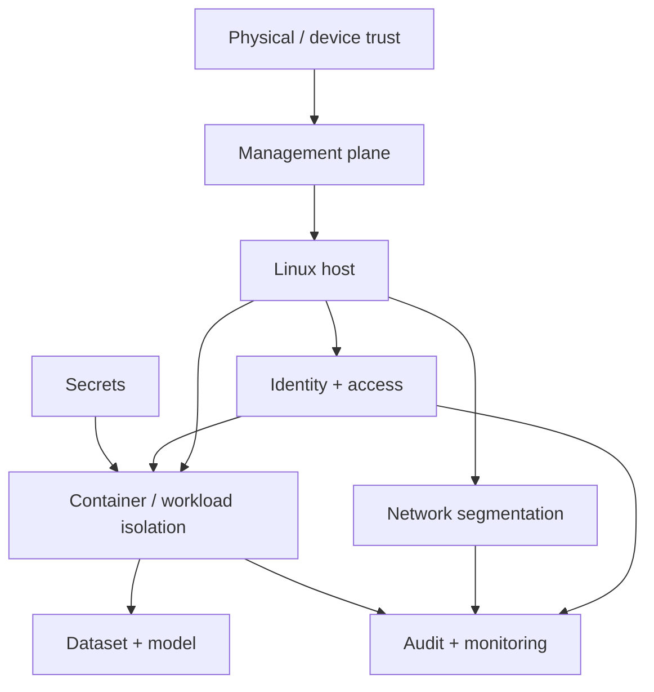

# Private-AI-Foundry

> **Project Obsidian — build a private AI environment for sensitive workloads, then try to break your own trust assumptions before someone else does.**

## Skills you will build

- Threat modeling for AI infrastructure
- Linux host hardening and least privilege
- Network segmentation and management-plane separation
- Secrets handling and credential hygiene
- Container isolation and runtime security concepts
- Access control, auditing, and logging
- Patch/configuration discipline
- Secure workload and data-flow reasoning
- Privacy-preserving ML context and where it does—and does not—help
- Defense-in-depth design for on-prem/private AI

## General idea

Private-AI-Foundry is the **secure/private AI infrastructure lab**.

A fictional research organization called **Aster Labs** has a model-development project that cannot use public AI services because its training data is sensitive. They want a small private environment where researchers can run accelerated workloads without giving every user unrestricted access to the host, secrets, management interfaces, data, or one another's work.

You are asked to design and build **Project Obsidian**: a defensible private AI environment.

The lab is not about making a laptop “military grade.” It is about learning to ask the security questions an infrastructure engineer should ask at every layer:

> **What am I protecting, from whom, through which path, and what control actually reduces that risk?**

This is a defensive lab. It should use synthetic data, local test accounts, and intentionally fictional infrastructure rather than real employer or customer information.

---

# The story: Aster Labs has a trust problem

Aster Labs begins with a dangerously simple design:

```text
Researcher
   ↓
SSH
   ↓
Linux host
   ↓
GPU container
   ↓
Sensitive dataset + model
```

Someone asks a few uncomfortable questions:

- Can every researcher become root?
- Where are credentials stored?
- Can a workload reach the management plane?
- Can one container see another workload's files?
- What gets logged?
- What happens when an employee leaves?
- Can secrets accidentally land in Git?
- Does encrypting a dataset matter if the host itself is compromised?
- Where does privacy-preserving ML fit into this picture?

Nobody has a complete answer.

That becomes your mission.

---

## Foundry campaign

| Phase | Security problem | Core skills | Deliverable |
|---|---|---|---|
| 00 | **Name the Crown Jewels** | assets, trust boundaries, threats | first threat model |
| 01 | **Lock the Workshop** | users, groups, sudo, SSH | hardened host access model |
| 02 | **Separate the Hallways** | segmentation, firewalling, management plane | network trust-boundary diagram |
| 03 | **The Secret Nobody Should Know** | secrets handling | remove plaintext/shared-secret anti-patterns |
| 04 | **Contain the Experiment** | containers, mounts, privileges | constrained workload model |
| 05 | **Who Touched the Model?** | logging, auditing, accountability | useful audit trail |
| 06 | **Patch Without Panic** | updates, change control, rollback | maintenance procedure |
| 07 | **The Insider Question** | least privilege, role separation | access-control review |
| 08 | **The Stolen Laptop Scenario** | data-at-rest and credential risk | mitigation analysis |
| 09 | **Privacy Is Not a Firewall** | PPML, DP, confidential-computing concepts | control-boundary comparison |
| 10 | **Red-Team the Assumptions** | defensive validation | find and close design weaknesses |
| FINAL | **Obsidian Review Board** | architecture defense | defend the design against a fictional security review |

---

## Defense-in-depth map



The diagram should evolve as you discover new trust boundaries.

---

## The Foundry rule

Every control must be tied to a threat.

Bad reasoning:

> “We enabled feature X because it is secure.”

Better reasoning:

```text
Asset: model checkpoint
Threat: unauthorized user copies it
Path: shared host filesystem
Control: restrictive ownership + role separation + audited access
Residual risk: privileged host administrator can still access the file
```

The lab should repeatedly distinguish **control**, **assumption**, and **residual risk**.

---

## Security drills

Defensive scenarios can include:

### The Forgotten Account
A former researcher's account still has access. Determine which controls should have prevented or detected that.

### The Secret in Git
A synthetic API token is intentionally committed to a private test repository. Practice identifying the exposure path, revoking the fake credential, removing the bad workflow, and preventing recurrence.

### The Overprivileged Container
A workload has far more host access than it needs. Reduce privileges while preserving its function.

### The Flat Network
Management, workload, and user traffic all share the same trust zone. Redesign the boundaries.

### The Invisible Administrator
A privileged action occurs with no useful audit trail. Improve accountability.

The purpose is not offensive exploitation. It is to validate that the defensive architecture actually matches the threat model.

---

## Privacy-preserving ML chapter

This project has a special role for PPML because privacy technologies are often misunderstood as general-purpose infrastructure security.

Create a comparison such as:

| Problem | Infrastructure control? | PPML/privacy technique? | Both? |
|---|---|---|---|
| Stolen SSH credential | | | |
| Model memorization / leakage | | | |
| Untrusted host administrator | | | |
| Exposed plaintext secret | | | |
| Training-data inference risk | | | |
| Network eavesdropping | | | |

The goal is to understand where techniques such as differential privacy, secure computation, encryption, or confidential-computing concepts fit—and where they do not replace ordinary systems security.

---

## Evidence to keep

Good artifacts include:

- threat models
- data-flow diagrams
- trust-boundary diagrams
- synthetic user/role matrices
- hardened configuration examples
- firewall/segmentation rules for the lab
- container security comparisons
- audit/logging examples
- security review findings
- remediation notes
- a final architecture decision record

Never include real credentials, employer configurations, customer data, internal hostnames, or private network details.

---

## Suggested repository structure

```text
Private-AI-Foundry/
├── README.md
├── threat-model/
├── architecture/
├── hardening/
├── network/
├── identity/
├── containers/
├── secrets/
├── audits/
├── drills/
└── evidence/
```

---

## Completion standard

Private-AI-Foundry is complete when you can be given a proposed private AI deployment and systematically ask:

- what the assets are,
- where trust boundaries exist,
- who can access what,
- how data and credentials move,
- which controls address which threats,
- how activity is audited,
- and what risks remain.

The final deliverable is not a claim that the environment is **secure**.

It is a defensible statement of:

> **what it protects, how it protects it, and where its limits are.**
